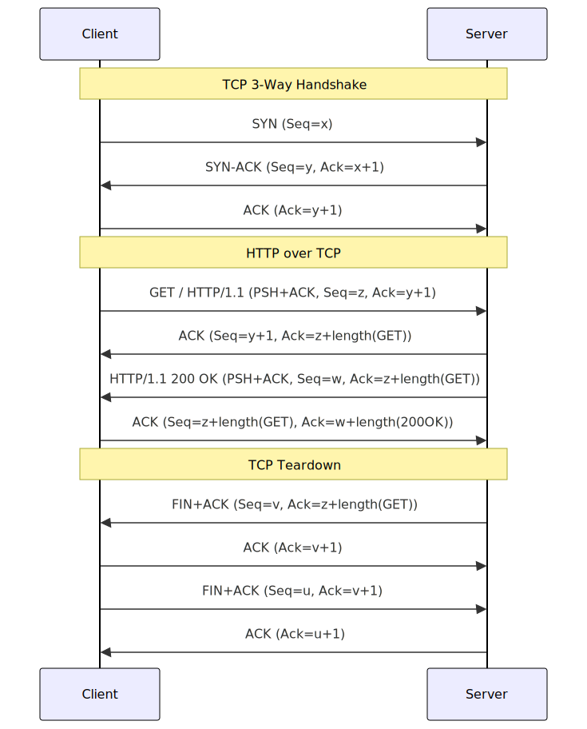

# Networking Programming Report: TCP/UDP Communications Using Sockets

> **Notes:** 
>
> - Each section has its related files (`.pcap`, `.c`, etc.) in a separate folder.
>
> - Below experiments were carried on linux.
>

## 1. Introduction:
Packet capture tools are essential for network programming, enabling developers to monitor traffic, troubleshoot issues, and optimize performance.

In this section, we get introduced to packet capture tools like `tcpdump` and `wireshark` in order to understand the inner workings of network communications, as well as to debug and verify the correctness of our programs.

We'll use **`tshark` (the command-line version of Wireshark)** as it provides the same functionality as `wireshark` while being easily expressed in text format (command).

**Why `tshark`?**

While `tcpdump` is excellent for basic packet capture, **`tshark` provides deeper protocol analysis** (like Wireshark) while remaining CLI-friendly. 

Key advantages:

- **HTTP/HTTPS parsing** (extracts headers, payloads)

- **Better filtering** (Wireshark-style display filters)

- **PCAP compatibility** (same files work in Wireshark)


Here are examples of `tshark` usage:
``` bash
# Note: using tshark generally require sudo privileges to access interfaces, or being part of wireshark unix group

# Check available network interfaces
tshark -D

# Capture all packets on a specific interface (eth0) and save to file "dump.pcap"
tshark -i eth0 -w dump.pcap

# Read the dumped packets from a PCAP file
tshark -r dump.pcap

# Capture packets on all interfaces and display output in real-time
tshark -i any

# Capture ICMP packets on interface eth0
tshark -i eth0 'icmp'

# Capture TCP packets from a specific host (192.168.1.10)
tshark -i any 'tcp and host 192.168.1.10'

# Capture UDP packets on port 400
tshark -i any 'udp and port 400'

# Capture IP packets from network 192.168.1.0/24 (address range)
tshark -i any 'ip and net 192.168.1.0/24'

# Capture TCP packets from port 80 (HTTP)
tshark -i any 'tcp and src port 80'

# Capture TCP packets to port 443 (HTTPS)
tshark -i any 'tcp and dst port 443'

# Capture TCP packets and limit the size of each packet to the first 20 bytes
tshark -i any -s 20 'tcp' # -s 0 give you maximium capture length

# Read a PCAP file with HTTP filter
tshark -r dump.pcap -Y "http"

# Capture HTTP traffic from a specific host
tshark -i eth0 -Y "http.host == example.com" -w http.pcap
```

For example, we will capture packets for a request to a tcp echo server `tcpbin.com`
- First we launch tcpdump to capture packets.
``` bash
# Save tcp packets from tcp bin with payload incuded
tshark -i wlp3s0 -w echo.pcap -s 0 'tcp and host tcpbin.com'
```
- Then in another terminal, we use the TCP echo server.
``` bash
echo hello | nc tcpbin.com 4242
```
- we stop `tshark` `^C` and read the resulting pcap file.
``` bash
# preview packets as json
tshark -r echo.pcap -T json
```

## 2. Developing an HTTP Client:
### 2.1. Verifying Presence of HTTP Server:
We first ping `10.250.101.1` to verify connectivity.
``` bash
ping 10.250.101.1
```
We get a 100% packet loss; thus, the address is not available.
We'll use instead an online HTTP server for testing: `example.com`.
We'll also use netcat or `nc` as a TCP client to send `HEAD` HTTP request, to verify the existence of the HTTP server (we get only the header of the http response).
``` bash
(
printf 'HEAD / HTTP/1.1\r\n'
printf 'Host: example.com\r\n' # needed for HTTP 1.1
printf 'Connection: close\r\n' # close connection after response
printf '\r\n' # double newline to declare end of request
) | nc example.com 80
# output:
# HTTP/1.1 200 OK
# Content-Type: text/html
# ETag: "84238dfc8092e5d9c0dac8ef93371a07:1736799080.121134"
# Last-Modified: Mon, 13 Jan 2025 20:11:20 GMT
# Cache-Control: max-age=3252
# Date: Sat, 03 May 2025 19:28:05 GMT
# Connection: close
```

Next, we send a GET request to get a body response in addition to the header.
``` bash
(
printf 'GET / HTTP/1.1\r\n'
printf 'Host: example.com\r\n'
printf 'Connection: close\r\n'
printf '\r\n' 
) | nc example.com 80
# output:
#HTTP/1.1 200 OK
#Content-Type: text/html
#ETag: "84238dfc8092e5d9c0dac8ef93371a07:1736799080.121134"
#Last-Modified: Mon, 13 Jan 2025 20:11:20 GMT
#Cache-Control: max-age=3229
#Date: Sat, 03 May 2025 19:34:41 GMT
#Content-Length: 1256
#Connection: close
#X-N: S
#
#<!doctype html>
#<html>
#<head>
#    <title>Example Domain</title>
#
#    <meta charset="utf-8" />
#    <meta http-equiv="Content-type" content="text/html; charset=utf-8" />
#    <meta name="viewport" content="width=device-width, initial-scale=1" />
#    <style type="text/css">

#...

#    </style>    
#</head>
#
#<body>
#<div>
#    <h1>Example Domain</h1>
#    <p>This domain is for use in illustrative examples in documents. You may use this
#    domain in literature without prior coordination or asking for permission.</p>
#    <p><a href="https://www.iana.org/domains/example">More information...</a></p>
#</div>
#</body>
#</html>
```

We conclude the `HEAD` gives only header of a http response while `GET` give both. (header and body).

The header contains information like the response code (200 OK), the content type (text/html), content length and other information...

The body is the data the server gives back, in this case an html page: `http://example.edu/`.
### 2.2 HTTP client in connected mode:
We start by creating a simple TCP client similar to the one that `nc` provides.
We capture the TCP packets using the command
``` bash
# On terminal 1
tshark -i wlp3s0 -w http.pcap -s 0 -f "tcp and host example.edu and port 80"

# On terminal 2
(
printf 'GET / HTTP/1.1\r\n'
printf 'Host: example.edu\r\n'
printf 'Connection: close\r\n'
printf '\r\n' 
) | ./client example.edu
```
We get 10 packets, which we inspect as follows:
``` bash
# IP frames information
tshark -r http.pcap -T json | jq '.[] | ._source.layers.ip'
# TCP segments information
tshark -r http.pcap -T json | jq '.[] | ._source.layers.tcp'
# TCP messages information
tshark -r http.pcap -T json | jq '.[] | ._source.layers.http' # not all packets contain http
```
**TCP data flow:**

We can analyze the TCP data flow for this use case.
``` bash
tshark -r http.pcap -T json | jq '.[] | {
  direction: (if (._source.layers.tcp["tcp.srcport"] == "80") then "<-" else "->" end),
  flags: ._source.layers.tcp."tcp.flags_tree"."tcp.flags.str",
  src_port: ._source.layers.tcp["tcp.srcport"],
  dst_port: ._source.layers.tcp["tcp.dstport"]
}'
# Output:
#{
#  "direction": "->",
#  "flags": "··········S·",
#  "src_port": "46958",
#  "dst_port": "80"
#}
#{
#  "direction": "<-",
#  "flags": "·······A··S·",
#  "src_port": "80",
#  "dst_port": "46958"
#}
#{
#  "direction": "->",
#  "flags": "·······A····",
#  "src_port": "46958",
#  "dst_port": "80"
#}
#{
#  "direction": "->",
#  "flags": "·······AP···",
#  "src_port": "46958",
#  "dst_port": "80"
#}
#{
#  "direction": "<-",
#  "flags": "·······A····",
#  "src_port": "80",
#  "dst_port": "46958"
#}
#{
#  "direction": "<-",
#  "flags": "·······AP···",
#  "src_port": "80",
#  "dst_port": "46958"
#}
#{
#  "direction": "<-",
#  "flags": "·······A···F",
#  "src_port": "80",
#  "dst_port": "46958"
#}
#{
#  "direction": "->",
#  "flags": "·······A····",
#  "src_port": "46958",
#  "dst_port": "80"
#}
#{
#  "direction": "->",
#  "flags": "·······A···F",
#  "src_port": "46958",
#  "dst_port": "80"
#}
#{
#  "direction": "<-",
#  "flags": "·······A····",
#  "src_port": "80",
#  "dst_port": "46958"
#}
```
- *Three-Way Handshake:* Establishes connection
  - `-> SYN`: Client sends SYN (synchronize) to initiate connection.
  - `<- SYN-ACK`: Server responds with SYN-ACK (synchronize-acknowledge)
  - `-> ACK`: Client sends final ACK to complete handshake
- *HTTP Request/Response:*
  - `-> PSH+ACK`: Client pushes HTTP request (PSH flag means "send data now").
  - `<- ACK`: Server acknowledges receiving request
  - `<- PSH+ACK`: Server pushes HTTP response back
- *Graceful Termination:* Four-way handshake
  - `<- FIN+ACK`: Server initiates connection closure
  - `-> ACK`: Client acknowledges server's FIN
  - `-> FIN+ACK`: Client sends its own FIN
  - `<- ACK`: Server acknowledges client's FIN

**TCP chronogram:**




**HTTP data flow**:

We can analyze the HTTP data flow using:
``` bash
tshark -r http.pcap -T json -Y http | jq '.[] | ._source.layers.http'
# Output:
#{
#  "GET / HTTP/1.1\\r\\n": {
#    "_ws.expert": {
#      "http.chat": "",
#      "_ws.expert.message": "GET / HTTP/1.1\\r\\n",
#      "_ws.expert.severity": "2097152",
#      "_ws.expert.group": "33554432"
#    },
#    "http.request.method": "GET",
#    "http.request.uri": "/",
#    "http.request.version": "HTTP/1.1"
#  },
#  "http.host": "example.edu",
#  "http.request.line": "Connection: close\r\n",
#  "http.connection": "close",
#  "\\r\\n": "",
#  "http.request.full_uri": "http://example.edu/",
#  "http.request": "1",
#  "http.request_number": "1"
#}
#{
#  "HTTP/1.1 200 OK\\r\\n": {
#    "_ws.expert": {
#      "http.chat": "",
#      "_ws.expert.message": "HTTP/1.1 200 OK\\r\\n",
#      "_ws.expert.severity": "2097152",
#      "_ws.expert.group": "33554432"
#    },
#    "http.response.version": "HTTP/1.1",
#    "http.response.code": "200",
#    "http.response.code.desc": "OK",
#    "http.response.phrase": "OK"
#  },
#  "http.content_type": "text/html",
#  "http.response.line": "Connection: close\r\n",
#  "http.last_modified": "Mon, 13 Jan 2025 20:11:20 GMT",
#  "http.cache_control": "max-age=603",
#  "http.date": "Sun, 04 May 2025 18:08:35 GMT",
#  "http.content_length_header": "1256",
#  "http.content_length_header_tree": {
#    "http.content_length": "1256"
#  },
#  "http.connection": "close",
#  "\\r\\n": "",
#  "http.response": "1",
#  "http.response_number": "1",
#  "http.time": "0.313623993",
#  "http.request_in": "4",
#  "http.response_for.uri": "http://example.edu/",
#  "http.file_data": "3c:21:64:6f:63:74:79:70:65:20:68:74:6d:6c:3e:0a:3c:68:74:6d:6c:3e:0a:3c:68:65:61:64:3e:0a:20:20:20:20:3c:74:69:74:6c:65:3e:45:78:61:6d:70:6c:65:20:44:6f:6d:61:69:6e:3c:2f:74:69:74:6c:65:3e:0a:0a:20:20:20:20:3c:6d:65:74:61:20:63:68:61:72:73:65:74:3d:22:75:74:66:2d:38:22:20:2f:3e:0a:20:20:20:20:3c:6d:65:74:61:20:68:74:74:70:2d:65:71:75:69:76:3d:22:43:6f:6e:74:65:6e:74:2d:74:79:70:65:22:20:63:6f:6e:74:65:6e:74:3d:22:74:65:78:74:2f:68:74:6d:6c:3b:20:63:68:61:72:73:65:74:3d:75:74:66:2d:38:22:20:2f:3e:0a:20:20:20:20:3c:6d:65:74:61:20:6e:61:6d:65:3d:22:76:69:65:77:70:6f:72:74:22:20:63:6f:6e:74:65:6e:74:3d:22:77:69:64:74:68:3d:64:65:76:69:63:65:2d:77:69:64:74:68:2c:20:69:6e:69:74:69:61:6c:2d:73:63:61:6c:65:3d:31:22:20:2f:3e:0a:20:20:20:20:3c:73:74:79:6c:65:20:74:79:70:65:3d:22:74:65:78:74:2f:63:73:73:22:3e:0a:20:20:20:20:62:6f:64:79:20:7b:0a:20:20:20:20:20:20:20:20:62:61:63:6b:67:72:6f:75:6e:64:2d:63:6f:6c:6f:72:3a:20:23:66:30:66:30:66:32:3b:0a:20:20:20:20:20:20:20:20:6d:61:72:67:69:6e:3a:20:30:3b:0a:20:20:20:20:20:20:20:20:70:61:64:64:69:6e:67:3a:20:30:3b:0a:20:20:20:20:20:20:20:20:66:6f:6e:74:2d:66:61:6d:69:6c:79:3a:20:2d:61:70:70:6c:65:2d:73:79:73:74:65:6d:2c:20:73:79:73:74:65:6d:2d:75:69:2c:20:42:6c:69:6e:6b:4d:61:63:53:79:73:74:65:6d:46:6f:6e:74:2c:20:22:53:65:67:6f:65:20:55:49:22:2c:20:22:4f:70:65:6e:20:53:61:6e:73:22:2c:20:22:48:65:6c:76:65:74:69:63:61:20:4e:65:75:65:22:2c:20:48:65:6c:76:65:74:69:63:61:2c:20:41:72:69:61:6c:2c:20:73:61:6e:73:2d:73:65:72:69:66:3b:0a:20:20:20:20:20:20:20:20:0a:20:20:20:20:7d:0a:20:20:20:20:64:69:76:20:7b:0a:20:20:20:20:20:20:20:20:77:69:64:74:68:3a:20:36:30:30:70:78:3b:0a:20:20:20:20:20:20:20:20:6d:61:72:67:69:6e:3a:20:35:65:6d:20:61:75:74:6f:3b:0a:20:20:20:20:20:20:20:20:70:61:64:64:69:6e:67:3a:20:32:65:6d:3b:0a:20:20:20:20:20:20:20:20:62:61:63:6b:67:72:6f:75:6e:64:2d:63:6f:6c:6f:72:3a:20:23:66:64:66:64:66:66:3b:0a:20:20:20:20:20:20:20:20:62:6f:72:64:65:72:2d:72:61:64:69:75:73:3a:20:30:2e:35:65:6d:3b:0a:20:20:20:20:20:20:20:20:62:6f:78:2d:73:68:61:64:6f:77:3a:20:32:70:78:20:33:70:78:20:37:70:78:20:32:70:78:20:72:67:62:61:28:30:2c:30:2c:30:2c:30:2e:30:32:29:3b:0a:20:20:20:20:7d:0a:20:20:20:20:61:3a:6c:69:6e:6b:2c:20:61:3a:76:69:73:69:74:65:64:20:7b:0a:20:20:20:20:20:20:20:20:63:6f:6c:6f:72:3a:20:23:33:38:34:38:38:66:3b:0a:20:20:20:20:20:20:20:20:74:65:78:74:2d:64:65:63:6f:72:61:74:69:6f:6e:3a:20:6e:6f:6e:65:3b:0a:20:20:20:20:7d:0a:20:20:20:20:40:6d:65:64:69:61:20:28:6d:61:78:2d:77:69:64:74:68:3a:20:37:30:30:70:78:29:20:7b:0a:20:20:20:20:20:20:20:20:64:69:76:20:7b:0a:20:20:20:20:20:20:20:20:20:20:20:20:6d:61:72:67:69:6e:3a:20:30:20:61:75:74:6f:3b:0a:20:20:20:20:20:20:20:20:20:20:20:20:77:69:64:74:68:3a:20:61:75:74:6f:3b:0a:20:20:20:20:20:20:20:20:7d:0a:20:20:20:20:7d:0a:20:20:20:20:3c:2f:73:74:79:6c:65:3e:20:20:20:20:0a:3c:2f:68:65:61:64:3e:0a:0a:3c:62:6f:64:79:3e:0a:3c:64:69:76:3e:0a:20:20:20:20:3c:68:31:3e:45:78:61:6d:70:6c:65:20:44:6f:6d:61:69:6e:3c:2f:68:31:3e:0a:20:20:20:20:3c:70:3e:54:68:69:73:20:64:6f:6d:61:69:6e:20:69:73:20:66:6f:72:20:75:73:65:20:69:6e:20:69:6c:6c:75:73:74:72:61:74:69:76:65:20:65:78:61:6d:70:6c:65:73:20:69:6e:20:64:6f:63:75:6d:65:6e:74:73:2e:20:59:6f:75:20:6d:61:79:20:75:73:65:20:74:68:69:73:0a:20:20:20:20:64:6f:6d:61:69:6e:20:69:6e:20:6c:69:74:65:72:61:74:75:72:65:20:77:69:74:68:6f:75:74:20:70:72:69:6f:72:20:63:6f:6f:72:64:69:6e:61:74:69:6f:6e:20:6f:72:20:61:73:6b:69:6e:67:20:66:6f:72:20:70:65:72:6d:69:73:73:69:6f:6e:2e:3c:2f:70:3e:0a:20:20:20:20:3c:70:3e:3c:61:20:68:72:65:66:3d:22:68:74:74:70:73:3a:2f:2f:77:77:77:2e:69:61:6e:61:2e:6f:72:67:2f:64:6f:6d:61:69:6e:73:2f:65:78:61:6d:70:6c:65:22:3e:4d:6f:72:65:20:69:6e:66:6f:72:6d:61:74:69:6f:6e:2e:2e:2e:3c:2f:61:3e:3c:2f:70:3e:0a:3c:2f:64:69:76:3e:0a:3c:2f:62:6f:64:79:3e:0a:3c:2f:68:74:6d:6c:3e:0a"
#}
```
Basically, HTTP sends a request to the server with options about the connection and the response, and the server gives back a response with a headerntaining metadata (response, code, type...) and with a body(can be empty).

**Used ports :**

- `46958` on the client side (ephemeral)
- `80` on the server side (http)

**Who closes the connection ?**

In this case the server initiated connection closure because of `Connection: close`. However, generally it is either the client or the server because of a timeout.

**Comparison with already used client `nc`**:

Earlier we used `nc` to type an HTTP request, which upon packet capture gave 13(11~13 across tests) TCP packets, presenting the same 3-way handshake, a premature `FIN` after pushing the HTTP request. 

Then, the server triggered retransmission (`SYN-ACK`) followed by a response and a connection closure initiated by the server (`FIN-ACK`) as well as corresponding acknowledgements.

For some reason, `nc` consistently have prematurely cut the connection, unlike my client and `curl` (we tested that as well using `curl example.edu`). 

This is likely caused by timing problems as well as `netcat` implementation, which does not wait enough for the server response. As you can see when adding sleep:
``` bash
{
  printf "GET / HTTP/1.1\r\nHost: example.edu\r\nConnection: close\r\n\r\n";
  sleep 1;
} | nc example.edu 80
# this have produced 11 packets (1 duplicate ACK) but normal hanshake, transmission and teardown.
```

In both cases(with sleep and without), and because of TCP reliability, the response was transmitted without issues from the user's perspective.

> **Note:** the following PCAP files inside `2.2_simple_tcp_client` resulted by :
>
> `my.pcap`: `./client example.edu` (myclient)
>
> `http.pcap`: `nc example.edu 80` (nc without sleep)
> 
> `nc2.pcap`: `nc example.edu 80` (nc with sleep)
>
> `curl.pcap`: `curl http://example.edu` (curl)
>

## 3. Message Transfer In Connected Mode:

> **Note:** station 1 is client, station 2 is server
>

**Number of Transmissions**:

Exactly 1+60 with 1s delay and 1+43 without delay (2 or more messages get sent within the same TCP payload, since TCP is stream-oriented).
``` bash
./client | wc -l
```

**Analyzing TCP Segments**:

To automate the testing, we created a script `test.bash` which does the following:

- Create `tshark` process listening for TCP packets on port `8080`
- Launch server then client executable and capture output.
- Stop tshark and closes the server
- Log the results

We then parsed the files `tmp.pcap`, `server.out` and `client.out` to verify if there is a correspondence between the payload of TCP packets and the response that the client got.

``` bash
# get tcp payload in hex one at a line
# convert to ascii
# strip "Received time: " and compare
diff <(tshark -r tmp.pcap -Y "tcp.payload" -Tfields -e tcp.payload | xargs -I{} sh -c 'echo "{}" | xxd -r -p; echo ""') <(sed 's/Received time: //g' client.out) 
# Output
#1c1
#< Hello
#---
#> Sent message: Hello
#44a45
#> Failed to receive time from server
```
Thus, indeed we got 1-to-1 correspondance between the payload of TCP packets and the client recieved/sent messages

However, with a delay(1s), each message got sent on each TCP packet, with again no differences between the client received responses and tcp payloads

This is due to the kernel joining multiple messages into one TCP packet without a delay, and having some timeout for that buffering behavior.

No message loss happened either way.

**Network Link Failure:**

Since both server an client live on `localhost` thus using interface `lo` we can't cut some physical connection. However, we can simulate `lo` failure by:
``` bash
sudo ip link set lo down
```
Then reactivate it by:
``` bash
sudo ip link set lo up
```

The shorted cut(1s) resulted in no having any connection problems, while the longer one (30s) resulted in server retansmitting all 60 buffed payload into couple of responses (~ 12):
```
# client output
Sent message: Hello
Received time: 2025-05-05 22:27:35
Received time: 2025-05-05 22:27:36
Received time: 2025-05-05 22:27:37
Received time: 2025-05-05 22:27:38
Received time: 2025-05-05 22:27:392025-05-05 22:27:402025-05-05 22:27:412025-05-05 22:27:422025-05-05 22:27:432025-05-05 22:27:442025-05-05 22:27:452025-05-05 22:27:462025-05-05 22:27:472025-05-05 22:27:482025-05-05 22:27:492025-05-05 22:27:502025-05-05 22:27:512025-05-0
Received time: 5 22:27:522025-05-05 22:27:532025-05-05 22:27:542025-05-05 22:27:552025-05-05 22:27:562025-05-05 22:27:572025-05-05 22:27:582025-05-05 22:27:592025-05-05 22:28:002025-05-05 22:28:012025-05-05 22:28:022025-05-05 22:28:032025-05-05 22:28:042025-05-05 22:28:0
Received time: 52025-05-05 22:28:062025-05-05 22:28:072025-05-05 22:28:082025-05-05 22:28:092025-05-05 22:28:102025-05-05 22:28:112025-05-05 22:28:122025-05-05 22:28:132025-05-05 22:28:142025-05-05 22:28:152025-05-05 22:28:162025-05-05 22:28:172025-05-05 22:28:182025-05-
Received time: 05 22:28:192025-05-05 22:28:202025-05-05 22:28:212025-05-05 22:28:222025-05-05 22:28:232025-05-05 22:28:242025-05-05 22:28:252025-05-05 22:28:262025-05-05 22:28:272025-05-05 22:28:292025-05-05 22:28:302025-05-05 22:28:31
Received time: 2025-05-05 22:28:32
Received time: 2025-05-05 22:28:33
Received time: 2025-05-05 22:28:34
Received time: 2025-05-05 22:28:35
Failed to receive time from server
```
Here's `tshark` TCP packet(14) that has all the buffred non transmitted packets (`len=998`).
```
14 55.700462620    127.0.0.1 → 127.0.0.1    TCP 1054 8080 → 34692 [PSH, ACK] Seq=77 Ack=6 Win=65536 Len=988 TSval=1693676601 TSecr=1693676601 [TCP segment of a reassembled PDU]
```
Another difference is that packets 19-26 got retransmitted, including the teardown sequence, probably because of timeout cased by the interface deactivation.

A deactivation of >2min (ore indefinitely) caused hanging client and packet loss (the server kernel probably reset the server socket since it was already terminated)

**Multiple Clients:**

No, the server does not support multiple clients.
We can test this by:
``` bash
# terminal 1
./server # works fine
# terminal 2
./client # works fine
# terminal 3
./client # gets 0 bytes and teerminates
```

> **Notes:**
>
> files in `./3_time_server_client_tcp/`:
>
> - `client.c`, `server.c`: Code for tcp client/server, delay can be toggled by commenting line `sleep(1)`
>
> - `makefile`: For compilation of c code
>
> - `test.bash`: Bash script to test the client/server and log results in one command, delay is toggled by changing constants at the top of the script
>
> - `tmp.pcap`, `delay-tmp.pcap`: capture files without/with delay
>
> - similarely, `server.out`, `client.out`, `delay-server.out`, `delay-client.out`: the redirected output of running client and server code respectively wo./w. delay.

## 4. Message Transfer in Non-Connected Mode:

**Number of Transmissions:**

Without any delay, 1+60 transmission happened without loss. The same goes for the case with delay. In both cases we got one message for each `recv` call from the client, unlike with TCP.
``` bash
./client | wc -l
```
**Packet Analysis:**
We save the output of the client and server with and without delay in `.out` files and capture files in `.pcap` files similar to TCP. We toggle the delay by recompiling the `server.c`:


``` bash
# with delay
#terminal 1
tshark -i lo -w delay.pcap -s 0 'udp and port 8080'
#terminal 2
./server > delay-server.out
#terminal 3
./client > delay-client.out

# without delay#
#terminal 1
make # recompile server
tshark -i lo -w nodelay.pcap -s 0 'udp and port 8080'
#terminal 2
c
#terminal 3
./client > nodelay-client.out
```

We then inspect results:
``` bash
## For delay
# capture client message recieved by `recv`
cat delay-client.out | sed -e 's#^.*: ##g'
# capture from .pcap udp payload and decode from hex
tshark -r delay.pcap -Tfields -e udp.payload | xargs -I{} sh -c 'echo "{}" | xxd -r -p; echo ""'
# diff both (for delay and wo. delay)
# delay
diff <(cat delay-client.out | sed -e 's#^.*: ##g') <(tshark -r delay.pcap -Tfields -e udp.payload | xargs -I{} sh -c 'echo "{}" | xxd -r -p; echo ""')
# no delay
diff <(cat nodelay-client.out | sed -e 's#^.*: ##g') <(tshark -r nodelay.pcap -Tfields -e udp.payload | xargs -I{} sh -c 'echo "{}" | xxd -r -p; echo ""')
# Results: no diff for delay and for without delay
```

Indeed, every UDP packet had a 1-to-1 correspondence with a received/sent message by the client.

**Network link Failures:**
Same as before, we simulate this by enabling/disbaling `lo` interface.
``` bash
sudo ip link set lo down # disable
sudo ip link set lo up # enable
```
When disabling the interface, the client stayed hanging since it is expecting packets that were lost. The same happened when reactivating it, although after reactivating, more UDP packets were transmitted.

This is because UDP is connectionless protocol which dosen't have mechanisms like timeout or retransmission like TCP (in TCP case, server misses acknowledgement of the client and resends the data)

Thus UDP is not a reliable protocol to send streams of data or messages, for that we need a transport protocol like TCP or one on top of UDP(which just sends raw data without relaiability mechanisms)

**Multi client Support:**
Like in the TCP case, the server code can't deal with multiple clients. This can be tested by opening two processes of `./client` and noticing only the first was able to get responses. For multi client simultanious support, we need either to multiplex I/O(select, poll...), or have many threads/procs, which we will explore in the next section.

## 5. Concurrent Server:

### 5.1 Mono-Service:

To achieve concurrency in our server (responding simultaneously to multiple clients) we will `fork` (multi-processing) since it is the easiest way to achieve concurrency while still preserving the delay ie. the spacing by 1s. On the other hand, `poll` or `select` based implementations are more complex to achieve.

`fork` basically create another identical process that will have its own timer, sockets... thus will be independent of the main process, achieving parallelism via kernel scheduling.

We will test the concurrent functionnality using a python script(`test.py`) that launches many client as threads and calculates average/min/max delays between messages, as a testiment of prallelism. We will run this script with a low number then a high number of clients.

``` bash
python test.py 3
# Output:
#Aggregated statistics across all clients:
#Minimum delays: min=0.999934s, avg=1.000039s, max=1.000155s
#Maximum delays: min=1.000955s, avg=1.001735s, max=1.002612s
#Average delays: min=1.000606s, avg=1.000617s, max=1.000632s
python test.py 2000
# Output:
#Aggregated statistics across all clients:
#Minimum delays: min=0.000005s, avg=0.741315s, max=1.000014s
#Maximum delays: min=1.003262s, avg=5.196295s, max=12.246516s
#Average delays: min=1.000607s, avg=1.075922s, max=1.191136s
```

We can conclude that having a big number of clients can introduce latency(up to 12s in this case) and possibly denial of service.

### 5.2 Multi-Service:

**Implemented Services:**
- Time Service:
  - Continuously streams server timestamps (1/second for 60 seconds)
- Process Count Service (nbproc)
  - Returns current system process count
- System Info Service (sysinfo)
  - Provides basic system identification

**Concurrency Verification Method:**

We use an automated script to:
- launch 3 instances of each type of client(9 processes)
- log their output(`.out`) and precise timestamps(`.log`) for start and end to verify correctness and concurrency

We use the command below to print events(start and end of each client) at chronological order
``` bash
# Sort all .time.log files by their contents (timestamp)
for f in $(ls *.time.log | xargs -I{} sh -c 'echo "$(cat {}) {}"' | sort -n | cut -d' ' -f2); do
    echo "$f: $(cat $f)"
done
# Output:
#time1_start.time.log: 1746673907.541108958
#time2_start.time.log: 1746673907.541370947
#nbproc2_start.time.log: 1746673907.543940342
#nbproc1_start.time.log: 1746673907.543942759
#time3_start.time.log: 1746673907.544970589
#sysinfo2_start.time.log: 1746673907.546270428
#sysinfo3_start.time.log: 1746673907.547369215
#sysinfo1_start.time.log: 1746673907.550188989
#nbproc3_start.time.log: 1746673907.550222692
#nbproc1_end.time.log: 1746673907.557312952
#sysinfo3_end.time.log: 1746673907.557700439
#nbproc2_end.time.log: 1746673907.560136928
#sysinfo2_end.time.log: 1746673907.562068462
#sysinfo1_end.time.log: 1746673907.563008454
#nbproc3_end.time.log: 1746673907.563345209
#time1_end.time.log: 1746673966.580021958
#time2_end.time.log: 1746673966.580125768
#time3_end.time.log: 1746673966.592469037
```
The events are mixed and in sequence, thus all services responded correctly(inspect `.out` files) and concurrently.
